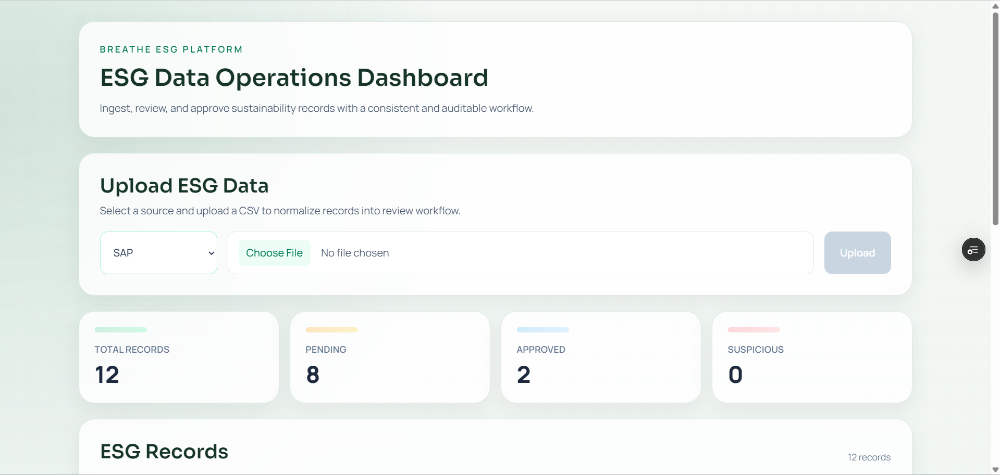

# Breathe ESG Platform

[](https://www.djangoproject.com/)
[](https://react.dev/)
[](https://www.postgresql.org/)
[](https://tailwindcss.com/)
[](https://render.com/)
[](https://vercel.com/)
[](#license)

Internal ESG data operations platform for ingesting heterogeneous operational exports, normalizing them into a consistent schema, preserving source evidence, and enforcing analyst review with auditability.

---

## Overview
Breathe ESG is a production-deployed full-stack system that turns fragmented ESG activity data into a controlled, reviewable operational workflow.

### Why This Project Exists
ESG reporting pipelines frequently fail at the ingestion layer: SAP exports, utility statements, and travel logs arrive in incompatible CSV formats, causing manual reconciliation and weak traceability. This platform solves that operational gap by separating:

- raw source capture (`RawData`) for forensic traceability,
- normalized reporting records (`NormalizedRecord`) for consistent downstream use,
- analyst decision lifecycle (`PENDING`, `SUSPICIOUS`, `APPROVED`, `REJECTED`) for governance,
- auditable state transitions (`AuditLog`) for accountability.

> [!NOTE]
> The project is designed as an internal operations platform, not a generic dashboard demo. Its core value is controlled ESG data quality and decision traceability.

---

## Dashboard Preview


---

## Features
| Capability | Implementation | Operational Value |
|---|---|---|
| Multi-source CSV ingestion | `POST /api/upload/` with source-specific parsing | Standard entry point for SAP, utility, and travel data |
| Raw data preservation | Row-level JSON snapshot in `RawData` | Full source lineage and replay support |
| Normalization layer | Source-to-schema mapping in ingestion service | Consistent analytics and review schema |
| Rule-based suspicious detection | Threshold-based classification during validation | Early outlier surfacing before approval |
| Analyst approval/rejection workflow | Review actions via record endpoints | Controlled acceptance of reporting records |
| Immutable approved state (workflow lock) | `is_locked=true` on approval | Prevents accidental post-approval edits in UI flow |
| Audit trail | Old/new status logged in `AuditLog` | Governance and incident investigation readiness |
| Operational dashboard | Status counts + record table | Real-time review queue visibility |

---

## Architecture
### System Topology
```text
+-------------------------------+
| Browser (Analyst Workspace)   |
+---------------+---------------+
                | HTTPS
                v
+-------------------------------+
| Frontend: React + Vite        |
| Hosted on Vercel              |
+---------------+---------------+
                | REST API
                v
+-------------------------------+
| Backend: Django + DRF         |
| Hosted on Render (Gunicorn)   |
+---------------+---------------+
                | ORM / SQL
                v
+-------------------------------+
| PostgreSQL (Render Managed DB)|
+-------------------------------+
```

### Backend Domain Modules
- `companies`: organization master data.
- `ingestion`: upload API, parsing, normalization orchestration.
- `reviews`: record listing, status transitions, dashboard stats.
- `audit`: audit trail model for governance events.

---

## Workflows
### Ingestion Workflow
1. Analyst uploads a CSV with `company_id`, `source_type`, and file payload.
2. API validates schema and source type.
3. `DataSource` batch metadata is persisted.
4. Each CSV row is saved to `RawData.raw_json` with `row_number`.
5. Row is normalized into ESG schema and written to `NormalizedRecord`.

### Normalization Workflow
| Source Type | Required Input Fields | Normalized Output |
|---|---|---|
| `SAP` | `MENGE`, `MEINS` | `Fuel`, `Scope 1`, numeric amount, source unit |
| `UTILITY` | `Usage_kWh` | `Electricity`, `Scope 2`, amount in `kWh` |
| `TRAVEL` | row-level trip data | `Business Travel`, `Scope 3`, amount `1`, unit `trip` |

Validation rules applied post-normalization:
- `amount < 0` -> `REJECTED`
- `amount > 100000` -> `SUSPICIOUS`
- otherwise -> `PENDING`

### Analyst Review Lifecycle
1. Dashboard loads queue and status metrics.
2. Analyst reviews `PENDING` and `SUSPICIOUS` records.
3. Action endpoint sets record state to `APPROVED` or `REJECTED`.
4. Approval locks workflow state (`is_locked=true`).
5. `AuditLog` captures before/after status and actor metadata.

---

## Tech Stack
| Layer | Technology | Responsibility |
|---|---|---|
| Backend Framework | Django 6 | Domain modeling, migrations, app architecture |
| API Layer | Django REST Framework | Request validation and REST endpoints |
| Data Processing | pandas | CSV parsing and row handling |
| Database | PostgreSQL | Relational persistence + JSON fields |
| Frontend | React 19 + Vite 8 | Analyst dashboard and action UI |
| Styling | Tailwind CSS 4 | Consistent UI composition |
| HTTP Client | Axios | Frontend-backend communication |
| Hosting (Backend) | Render | API runtime and managed database |
| Hosting (Frontend) | Vercel | Build, CDN delivery, environment config |

---

## API Overview
**Local base URL:** `http://127.0.0.1:8000/api/`  
**Production base URL:** `<RENDER_BACKEND_URL>/api/`

### Endpoints
| Method | Endpoint | Description |
|---|---|---|
| `POST` | `/upload/` | Upload and process a source CSV batch |
| `GET` | `/records/` | Retrieve normalized records (newest first) |
| `GET` | `/dashboard/stats/` | Retrieve aggregate review status metrics |
| `POST` | `/records/{id}/approve/` | Approve record and lock workflow state |
| `POST` | `/records/{id}/reject/` | Reject record |
| `GET` | `/records/suspicious/` | Retrieve suspicious records queue |

### Upload Contract (`multipart/form-data`)
| Field | Type | Required | Allowed Values / Example |
|---|---|---|---|
| `company_id` | Integer | Yes | `1` |
| `source_type` | Enum | Yes | `SAP`, `UTILITY`, `TRAVEL` |
| `file` | File | Yes | `sap_data.csv` |

### Example Upload
```bash
curl -X POST "http://127.0.0.1:8000/api/upload/" \
  -F "company_id=1" \
  -F "source_type=SAP" \
  -F "file=@sap_data.csv"
```

---

## Setup
### Prerequisites
- Python 3.12+
- Node.js 20+
- PostgreSQL 14+

### 1) Clone
```bash
git clone <your-repo-url>
cd breathe-esg
```

### 2) Backend
```bash
cd backend
python -m venv venv
venv\Scripts\activate
pip install -r requirements.txt
copy .env.example .env
python manage.py migrate
python manage.py runserver
```

### 3) Frontend
```bash
cd frontend
npm install
copy .env.example .env
npm run dev
```

> [!TIP]
> Current upload flow sends `company_id=1`; ensure a `Company` row with ID 1 exists in local DB.

---

## Deployment
### Frontend Deployment (Vercel)
- Build and host the React/Vite application.
- Configure `VITE_API_BASE_URL` to your Render backend API root (for example, `https://<backend>.onrender.com/api/`).

### Backend Deployment (Render Web Service)
- Deploy Django + Gunicorn service using `render.yaml`.
- Apply migrations after deployment.
- Configure secure env vars: `SECRET_KEY`, `DEBUG=False`, `ALLOWED_HOSTS`, CORS and CSRF trusted origins.

### Database Deployment (Render PostgreSQL)
- Use managed PostgreSQL instance.
- Connect via `DATABASE_URL` in backend environment.
- Maintain migration discipline for schema versioning.

---

## Future Improvements
- Asynchronous ingestion with queue workers (Celery + Redis) for large files.
- Authenticated RBAC and identity-backed audit actors.
- Configurable, versioned normalization rules by source/company.
- Rich anomaly detection (hybrid rules + statistical/ML scoring).
- High-volume review ergonomics: pagination, filtering, and bulk actions.
- Observability hardening: structured logs, traces, error alerting, SLO tracking.

---

## License
MIT License. See `LICENSE`.
